# Chat-Based Export Readiness Architecture

## System Flow Diagram

## Component Architecture

## Data Flow

## Supported Countries & Difficulty Levels

```mermaid
graph TB
    subgraph "Export Target Countries"
        A[🇲🇾 Malaysia<br/>Difficulty: Low]
        B[🇸🇬 Singapore<br/>Difficulty: Medium]
        C[🇦🇺 Australia<br/>Difficulty: Medium]
        D[🇰🇷 South Korea<br/>Difficulty: Medium]
        E[🇺🇸 United States<br/>Difficulty: High]
        F[🇪🇺 European Union<br/>Difficulty: High]
        G[🇯🇵 Japan<br/>Difficulty: High]
        H[🇨🇳 China<br/>Difficulty: High]
    end
    
    subgraph "Analysis Categories"
        I[Regulatory Compliance<br/>25%]
        J[Market Viability<br/>25%]
        K[Documentation Readiness<br/>25%]
        L[Competitive Positioning<br/>25%]
    end
    
    A --> I
    B --> I
    C --> I
    D --> I
    E --> I
    F --> I
    G --> I
    H --> I
    
    I --> M[Overall Score 0-100]
    J --> M
    K --> M
    L --> M
```

## Memory Bot Integration

## User Interaction Patterns

## Keywords & Triggers

---

## Technical Implementation

- **Framework**: Streamlit with Google Gemini AI
- **Language**: Python 3.13+
- **AI Model**: Gemini 2.0 Flash Experimental
- **Data Storage**: SQLite + Session State
- **Architecture**: Modular chat-based system

## Key Features

1. **Natural Language Processing** - Detects export analysis requests in conversation
2. **Contextual Analysis** - Uses existing business profile for personalized assessment
3. **Multi-Country Support** - 8 target countries with difficulty ratings
4. **Comprehensive Scoring** - 4 categories with 0-100 scoring system
5. **Memory Integration** - Automatic saving to assessment history
6. **Actionable Insights** - Specific steps, timelines, and recommendations